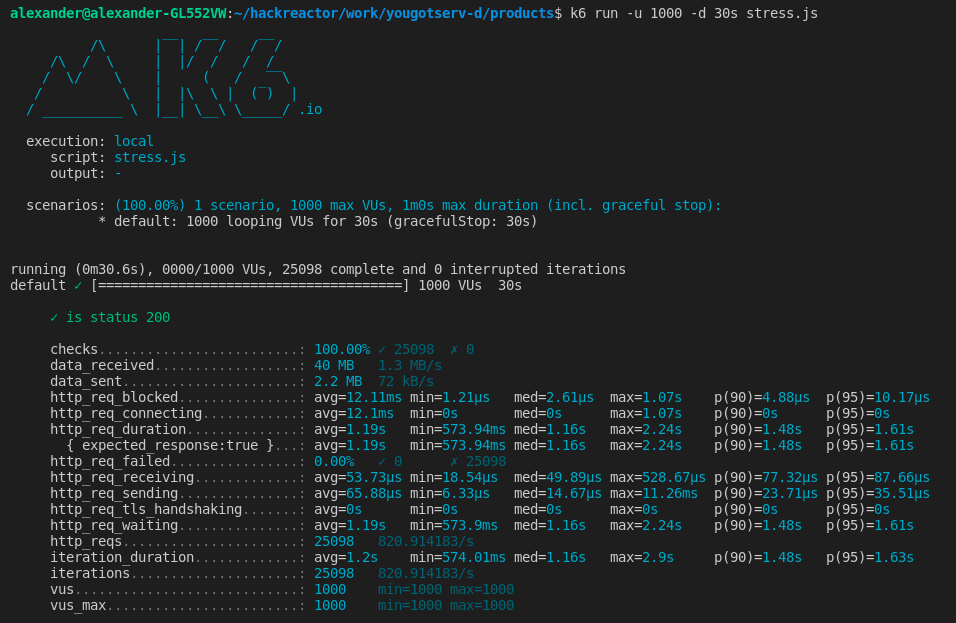
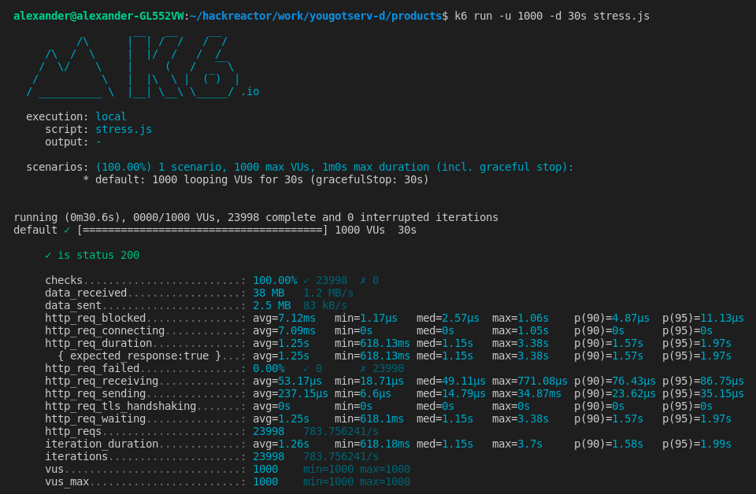
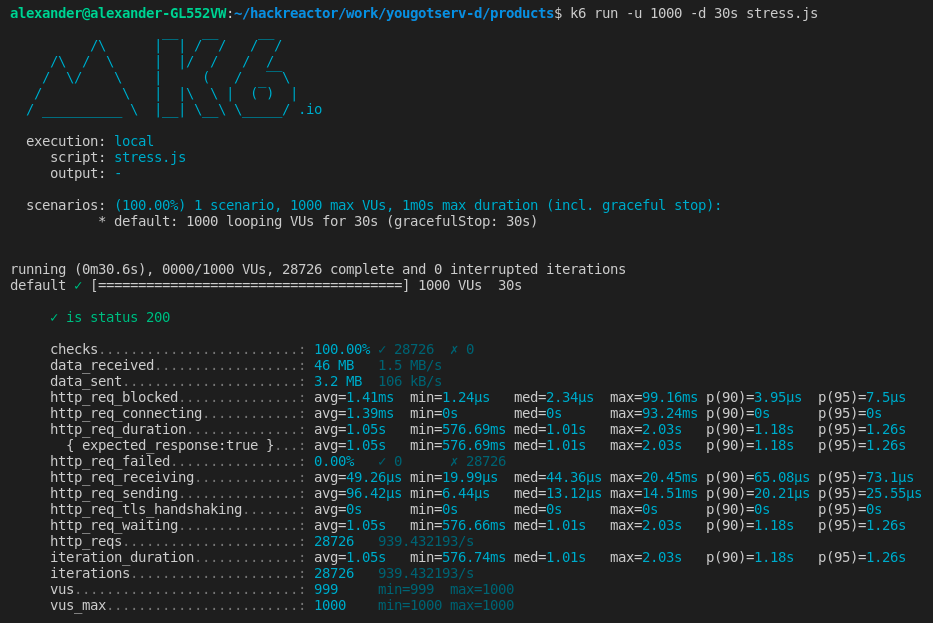
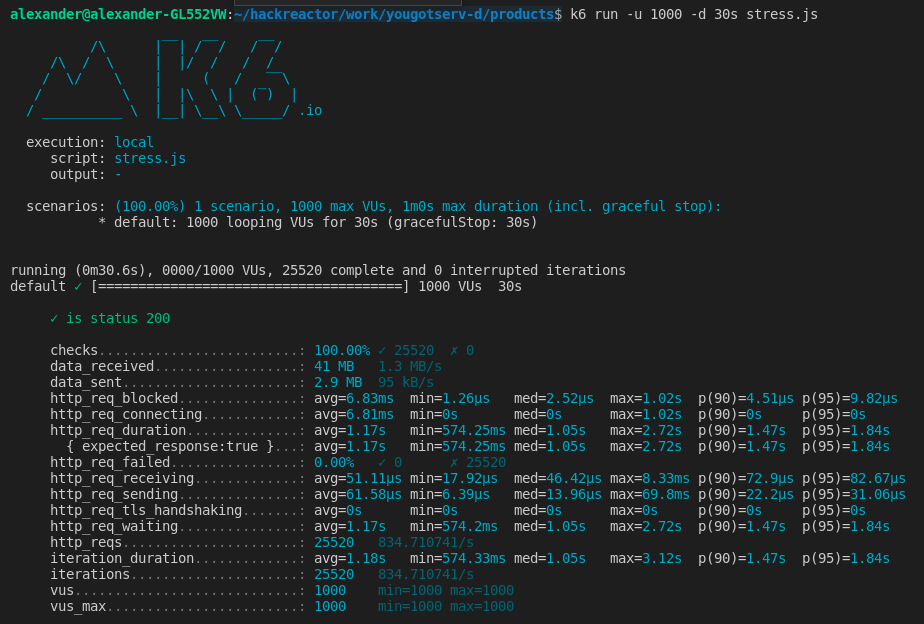

# 2021.06.28 Journal Entry

**Challenge**
1. Complete the outstanding SQL queries and other database tweaks.
2. Configure load testing tools.
3. Use k6 and newrelic for load testing.

**Actions**
1. I was finally able to use the right combination of json_agg, json_agg_object, and json_build_object to properly form the data to meet the API requirements.
   I was also able to add indicies to most tables after using EXPLAIN to find where it was parsing whole tables.
2. I installed k6 and connected new relic. Both were a bit quirky in their install process (newrelic requires you to copy from the node-modules and then subsequently move files into the root directory to get working).
3. I ran my initial load tests with k6.

**Result**
1. SQL queries are finally done. (see queries.js in root).
2. Testing tools are installed.
3. The initial tests came back and below are the results. I have added indicies where I think they are needed, may need to find more speed improvements.

Load test results:

Products:

Product:

Styles:

Related:

