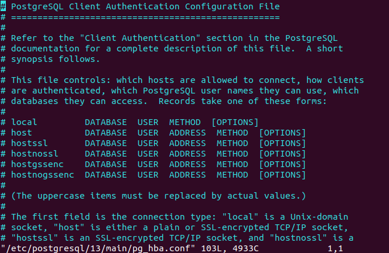
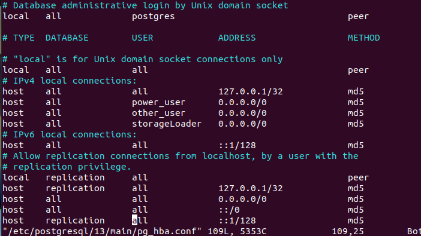

# 2021.07.02 Journal Entry

**Challenge**

Make the postgres db on the host is accessible to the docker containers. To do this I will need to:

1. Make the postgresql listen to an external ip address.
2. Let the docker container access the db with a given user.

**Actions**

On the EC2 instance I updated the postgresql.conf file

> sudo vim /etc/postgresql/13/main/postgresql.conf

Found the line

> #listen_addresses = 'localhost' # what IP address(es) to listen on;

Updated it to

> listen_addresses = '*' # what IP address(es) to listen on;

Then I restarted the db

> /etc/init.d/postgresql restart

Next I needed to give the container access to the database. I opened the pg_hba.conf file to allow this access.

Added the line

> postgres alexander 172.17.0.0/16 trust

I later was having more problems and needed to make additions.

I also needed to create the correct user/password in postgres and grant SELECT priveleges.

> GRANT SELECT ON ALL TABLES IN SCHEMA "public" TO alexander;

**Result**

Requests sent to endpoints at the EC2 instance return data correctly.

**Challenge**

Add a load balancer to the system.

**Actions**

I created a new EC2 instance for the load balancer and installed NGINX on it.

> sudo apt-get update
> sudo apt-get install nginx
> sudo nginx -v

The last confirms that the install worked.

Then to launch NGINX

> sudo nginx

