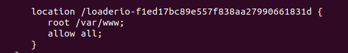
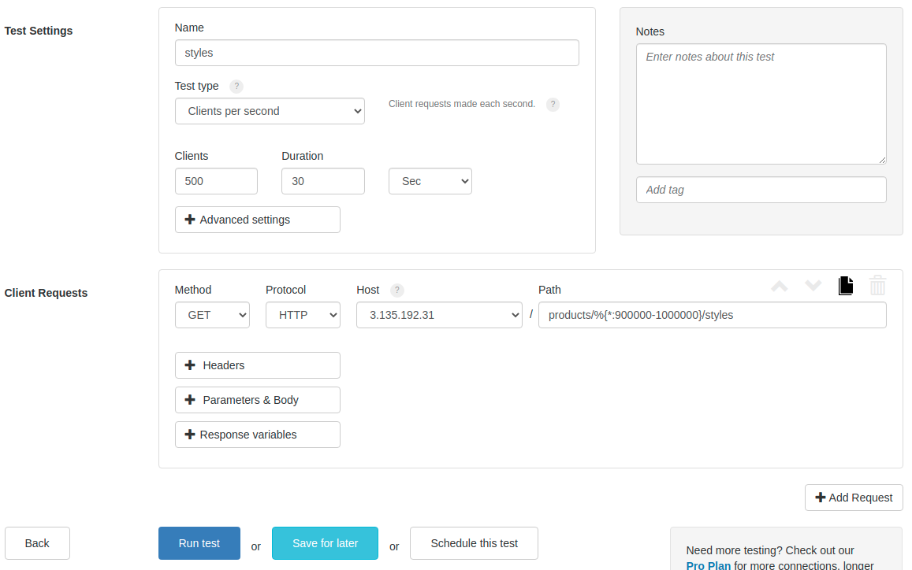
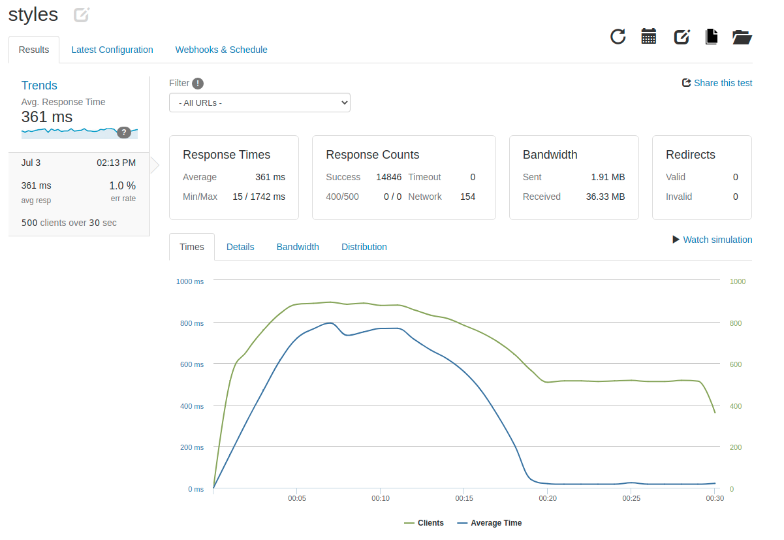
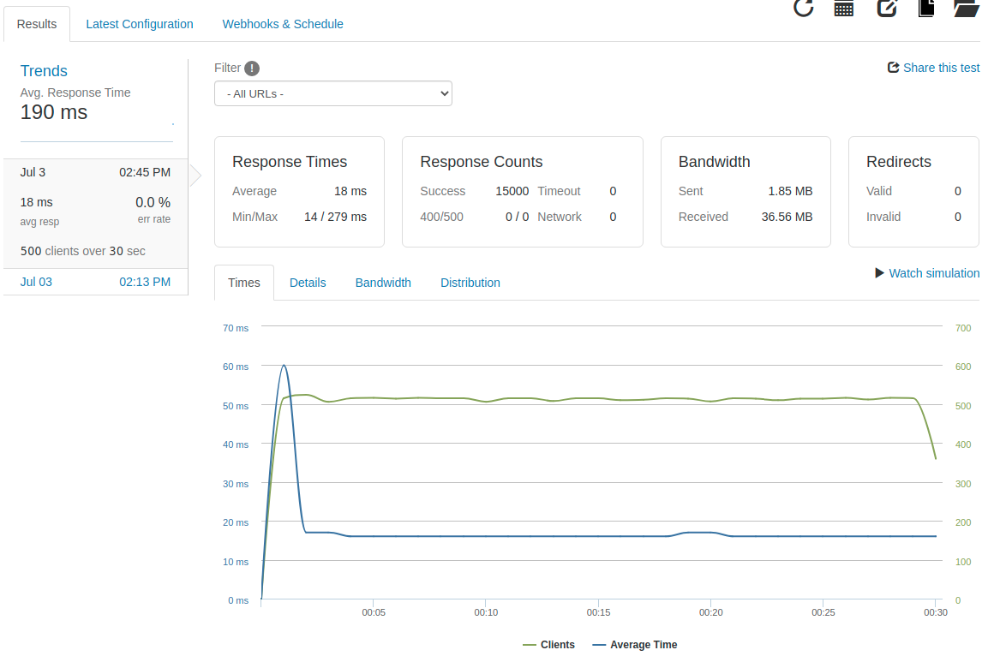
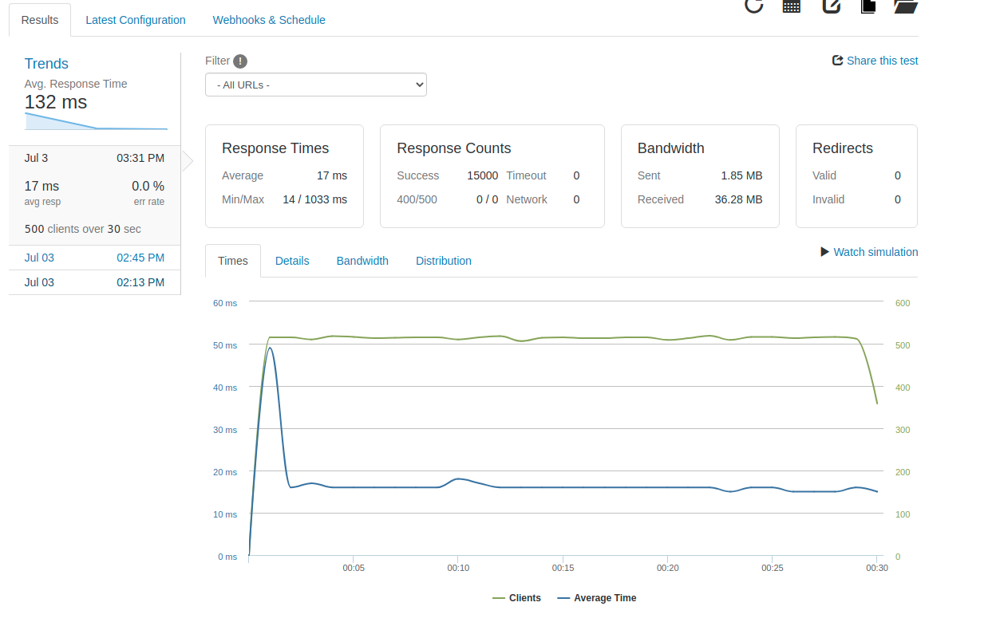
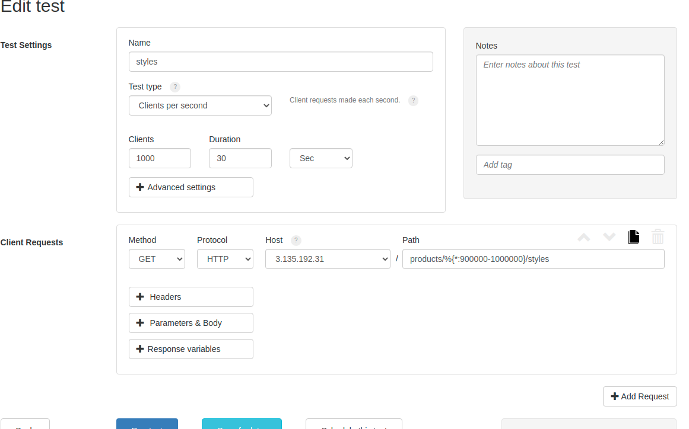
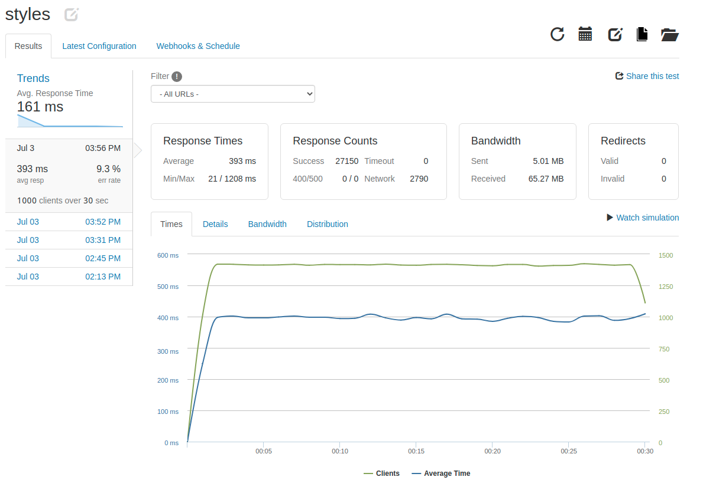

# 2021.07.03 Journal Entry

**Challenge**

My database is ready, I have two EC2 instances running servers, and both are connected to my load balancer. It's time to begin to load test the system and see what can be done to improve performance.

**Actions**

I added loader.io to the nginx load balancer so that I can monitor the performance of the whole system. I had to add a file called index.html to a folder on my nginx instance which contains a token to connect to loader.io. Then I told the nginx how to respond to requests for that endpoint in the nginx.conf settings.

From there I began to run my tests. I decided to test on the most complicated query and to specifically give it requests aimed at the last 10% of the data.

With two servers connected with the load balancer I got:

Response Times
Average	361 ms
Min/Max	15 / 1742 ms

Next I added a third server to the load balancer by spinning up a new EC2 instance, deploying a docker container with my server image, and adding it to the nginx configuration file.

To deploy the server I installed docker:

> sudo apt-get update

> sudo apt-get install docker-ce docker-ce-cli containerd.io

> apt install docker.io

Then I pulled down the docker image and created a container.

> docker login

> docker pull alexandercausey/products:latest

> docker run -d -p 80:3000 --name server_xx alexandercausey/products:latest

**Result**

With three servers I got:

Response Times
Average	18 ms
Min/Max	14 / 279 ms

With four servers:

Response Times
Average	17 ms
Min/Max	14 / 1033 ms

With five servers:

Response Times
Average	17 ms
Min/Max	14 / 388 ms

Increased the number of clients:

Response Times
Average	393 ms
Min/Max	21 / 1208 ms

